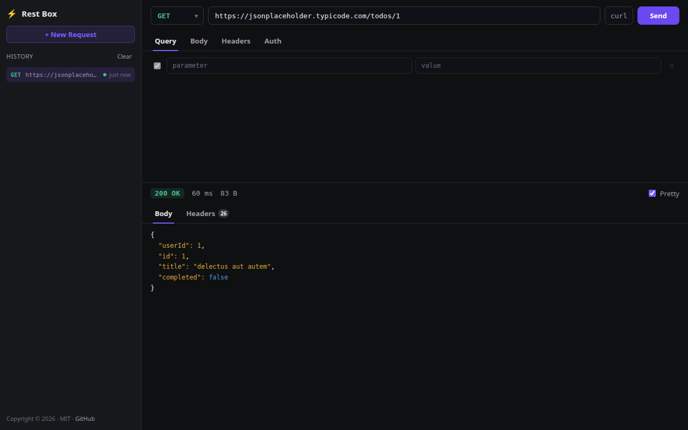

# restbox-wla

A browser-based HTTP request builder and response inspector. Compose a request —
method, URL, query params, headers, body, auth — press **Send**, and read back the
response: status, timing, size, headers and a pretty-printed body. History is kept
locally, and each entry restores both the request and the response it produced.



**The project is the UI.** A small Node server sits behind it only as a helper: it
serves the page (via Vite, with HMR, in dev) and exposes a single endpoint,
`POST /send`, that replays a request on the browser's behalf so the UI is not
limited by CORS. It keeps no state and does nothing else.

```
browser (React UI)  ──POST /send──▶  helper server  ──▶  target API
                    ◀──── JSON result ───
```

## Stack

| Part          | Choice                                                            |
| ------------- | ---------------------------------------------------------------- |
| UI            | React 19 + TypeScript, bundled with Vite — this is the project   |
| Helper server | one Node HTTP server (`server/index.js`): serves the page and proxies `POST /send` past CORS; runs Vite as middleware in dev |
| History       | last 50 requests *and their responses*, in `localStorage`; click one to reload the request and its response (bodies over 100 KB stored truncated) |
| Layout        | draggable sidebar width + request/response split, persisted in `localStorage` (double-click a divider to reset) |

## Getting started

```bash
npm install
npm run dev          # http://localhost:3000
```

`npm run dev` starts `server/index.js`, which mounts Vite (page + HMR) and the
`/send` helper on a single port.

### Production

```bash
npm run build        # tsc --noEmit && vite build  ->  dist/
npm start            # NODE_ENV=production node server/index.js, serves dist/
```

### Serving under a path prefix

Both the server and the build read a base URL, so the app can live under e.g.
`/tools/restbox`:

```bash
npm run dev   --base-url=/tools/restbox
npm run build --base-url=/tools/restbox
npm start     --base-url=/tools/restbox
```

### Changing the default starting URL

A fresh request draft starts with the page's own origin. Override it at build
(or dev) time with `--start-url`:

```bash
npm run dev   --start-url=https://api.example.com
npm run build --start-url=https://api.example.com
```

It is baked into the client bundle, so pass it to `npm run build`, not
`npm start` (which just serves the already-built `dist/`).

## Layout

```
server/
  index.js       single-port server: serves the page + POST /send request proxy
  base-url.js    shared base-URL helpers (server + vite.config.ts)
  start-url.js   shared default-start-URL helper (server + vite.config.ts)
tools/
  manifest-plugin.ts   writes dist/manifest.json describing the build
src/
  App.tsx              wires the panels together, owns request/response state
  request.ts           builder state -> wire payload, URL assembly, curl export
  api.ts               fetch wrapper around POST /send
  storage.ts           localStorage-backed history + layout
  components/
    Sidebar.tsx        brand, "New Request", history list
    RequestPanel.tsx   method + URL + Send, Query/Body/Headers/Auth tabs
    ResponsePanel.tsx  status/time/size, Body/Headers tabs
    BodyView.tsx       dependency-free JSON pretty-printer + highlighter
    KeyValueEditor.tsx Query / Headers / Form rows
    BodyEditor.tsx     None / JSON / Text / Form
    AuthEditor.tsx     None / Bearer / Basic
    ResizeHandle.tsx   draggable sidebar / split dividers
    MethodSelect.tsx, Tabs.tsx
```

## Helper API

### `POST /send`

The one endpoint the UI depends on. It replays the given request server-side and
returns the result as JSON.

```jsonc
{
  "method": "POST",
  "url": "https://api.example.com/users",
  "headers": { "Content-Type": "application/json" },
  "body": "{\"hello\":\"world\"}",   // optional; ignored for GET/HEAD
  "timeoutMs": 30000,                 // optional, 1000..120000
  "followRedirects": true             // optional, default true
}
```

Response:

```jsonc
{
  "status": 200,
  "statusText": "OK",
  "headers": { "content-type": "application/json", "...": "..." },
  "body": "…raw response text…",
  "timeMs": 128,
  "size": 512
}
```

Errors: `400` for a malformed request (bad method / non-http(s) URL / invalid JSON
body), `502 { "kind": "network" }` for DNS / connection / timeout failures.

## Notes / not included

- `POST /send` is an **open proxy to any http(s) URL** — fine for local dev,
  but put an allowlist or auth in front of it before exposing it publicly.
- The sibling `*-wla` projects ship a native (CMake / bitmake) server wrapper for
  deployment. That packaging layer is intentionally left out here; this repo is
  the UI plus its Node helper server.
- No response streaming, cookie jar, file upload, or multi-tab requests yet — the
  builder holds one request at a time, restorable from history.
```
